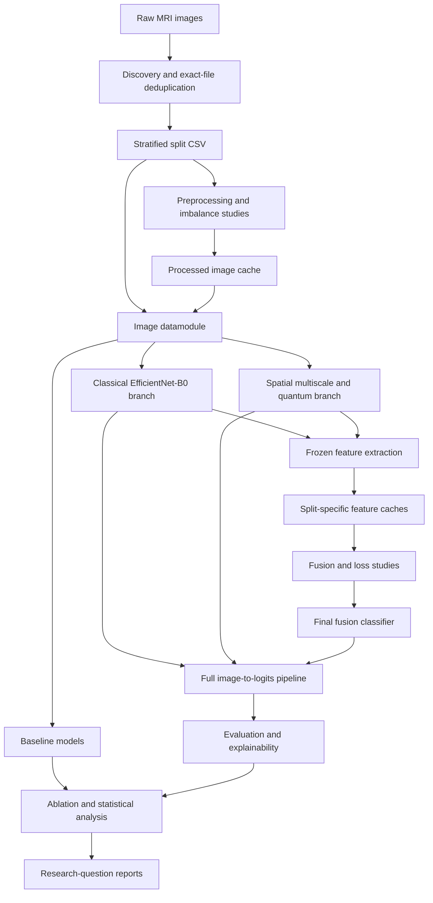

# Brain MRI Classification with Multiscale and Quantum Feature Fusion

A configurable research pipeline for four-class brain MRI classification using classical image features, adaptive multiscale convolutions, simulated quantum circuits, and feature fusion.

The repository includes dataset preparation, model training, controlled comparisons, evaluation, explainability, and statistical reporting, organized around the experiments defined in the [research specification](docs/Instruction%20BY%20asif%20vai.md).

> **Research status:** Training and analysis components are implemented, with recorded smoke-run outputs. A completed full-protocol study is not established by the available reports. Steps 21–25 and preprocessing confirmation require further experimental validation. See [Known limitations](#known-limitations) before running or interpreting the study.

## Overview

The task is to classify individual 2D MRI images into:

| Label | Class |
|---|---|
| `0` | Glioma |
| `1` | Meningioma |
| `2` | Pituitary |
| `3` | No-tumor |

The project investigates whether adaptive feature extraction and quantum transformations provide measurable benefits over conventional CNN and Transformer baselines.

It is an experiment framework that produces checkpoints, feature caches, tables, figures, and reports. It does not include a web interface, inference API, or clinical deployment workflow.

## Motivation

The study examines several related questions:

- Does image preprocessing improve classification?
- Which imbalance-handling strategies improve class-wise performance?
- Does spatially adaptive multiscale fusion outperform fixed receptive fields?
- Does a learned mixture of quantum circuits improve useful feature information?
- Which feature-fusion and loss formulations perform best on validation data?
- How do the models behave under external data, image degradation, and ablation?

Quantum components are evaluated as experimental alternatives. Superiority is not assumed, and negative results are valid study outcomes.

## Key Features

- Exact-file deduplication and stratified train/validation/test splitting.
- Dataset audits covering image properties, class distribution, corruption, and crop validation.
- Preprocessing comparisons using diffusion, Wiener filtering, CLAHE, gamma adjustment, and logarithmic transformation.
- Class weighting, focal loss, weighted sampling, and augmentation studies.
- CNN, Transformer, fixed multiscale, and fixed quantum baselines.
- Spatially adaptive multiscale feature extraction.
- A learned soft mixture of five simulated quantum circuits.
- Cached branch features for efficient fusion-head training.
- Concatenation, SE-style, and gated fusion comparisons.
- Internal and external evaluation, calibration metrics, and degradation sweeps.
- Grad-CAM, feature attribution, MC-dropout, and explanation sanity checks.
- Ablation tables, paired statistical comparisons, and research-question mapping.
- Hydra configuration and a resumable Kaggle pipeline runner.

## Architecture and Workflow



### Feature extraction and fusion

| Component | Default output | Description |
|---|---:|---|
| Classical branch | 1,280 features | EfficientNet-B0 image representation |
| Spatial branch | 32 features | Learned weighting of parallel convolution paths |
| Quantum branch | 4 features | Weighted mixture of circuit expectation values |
| Final fused representation | 192 features | Three projections of 64 features, concatenated |

The spatial module combines 3×3, 5×5, and dilated 3×3 convolutions. Its spatial gate computes a per-pixel softmax over the paths.

The quantum branch uses four qubits and five circuit designs: `fixed`, `deep`, `strong`, `combined`, and `reupload`. Every circuit executes for each image. A learned selector combines their outputs; it does not skip circuits or select a single circuit for execution.

Quantum computation uses PennyLane’s `default.qubit` simulator. This repository does not demonstrate execution on quantum hardware.

Branches are trained before feature extraction. Frozen features are cached for fusion training. The spatial features used by the final model come from inside the jointly trained Step 12 spatial/quantum branch; the independently trained Step 11 model supports separate ablation and morphology analyses.

### Experiment stages

| Stages | Purpose |
|---|---|
| 4 | Dataset audit and split preparation |
| 6 and confirmation | Preprocessing ranking and real-backbone confirmation |
| 8 | Imbalance-handling comparison |
| 9–12 | Baselines and feature-extraction branches |
| 13–15 | Fusion comparison, loss selection, and final classifier training |
| 16–18 | Internal, external, and robustness evaluation |
| 19–20 | Explainability and quantum contribution analysis |
| 21–23 | Ablation matrix, research-question mapping, and statistics |
| 24 | Controlled receptive-field comparison |
| 25 | Fixed-circuit versus adaptive-mixture comparison |

## Repository Structure

```text
.
├── configs/
│   ├── analysis/                 # Analysis-stage settings
│   ├── callbacks/                # Checkpointing and early stopping
│   ├── data/                     # Image, proxy, feature, and external data
│   ├── experiment/               # Experiment compositions
│   ├── loss/                     # Cross-entropy and focal losses
│   ├── model/                    # Baselines, branches, and fusion models
│   ├── protocol/fixed.yaml       # Shared training protocol
│   ├── trainer/                  # CPU, GPU, and distributed configurations
│   ├── analyze.yaml
│   ├── eval.yaml
│   ├── extract_features.yaml
│   ├── prepare_dataset.yaml
│   └── train.yaml
├── data/                         # Raw data, splits, and generated caches
├── docs/
│   ├── Instruction BY asif vai.md
│   ├── IMPLEMENTATION_PLAN.md
│   └── DEVIATIONS.md
├── notebooks/
│   ├── kaggle_run.ipynb          # Kaggle execution wrapper
│   └── mri_thesis_notebook.ipynb  # Historical research notebook
├── scripts/
│   ├── download_data.ps1
│   ├── download_data.sh
│   ├── kaggle_pipeline.py
│   └── make_kaggle_notebook.py
├── src/
│   ├── analysis/                # Studies, evaluation, and reporting
│   ├── data/
│   │   └── components/          # Splits, transforms, sampling, preprocessing
│   ├── models/
│   │   └── components/          # Backbones, gates, circuits, fusion, losses
│   ├── utils/                   # Metrics, statistics, checkpoints, logging
│   ├── analyze.py
│   ├── eval.py
│   ├── extract_features.py
│   ├── prepare_dataset.py
│   └── train.py
├── tests/
├── .github/workflows/
├── .pre-commit-config.yaml
├── environment.yaml
├── Makefile
├── pyproject.toml
├── requirements.txt
├── setup.py
└── USAGE.md
```

## Technologies and Dependencies

| Area | Libraries and tools |
|---|---|
| Deep learning | PyTorch, torchvision, Lightning, TorchMetrics |
| Configuration | Hydra, OmegaConf, rootutils |
| Quantum simulation | PennyLane |
| Data and statistics | NumPy, pandas, SciPy, scikit-learn |
| Imaging | Pillow, OpenCV, scikit-image, h5py, SimpleITK |
| Visualization | Matplotlib, seaborn |
| Explainability | SHAP |
| Development | pytest, pre-commit, GitHub Actions |
| Dataset access | Kaggle CLI |

[requirements.txt](requirements.txt) is the main dependency list. Most versions are not pinned.

SHAP is commented out there but imported by the current explainability stage. UMAP is optional; the analysis provides a t-SNE fallback. Optional logging integrations require their corresponding packages.

## Prerequisites

- A Python environment compatible with the packages in `requirements.txt`.
- Compatible PyTorch and torchvision installations.
- Kaggle credentials when using the dataset download scripts.
- Sufficient storage for datasets, processed images, checkpoints, and feature caches.
- A CUDA-capable GPU for practical execution of the full classical-model study.

Quantum simulation remains CPU-based. The Step 12 configuration advises against mixed precision and distributed training for the quantum branch.

The repository does not define a single fully pinned, validated environment. The Conda file contains template-era dependencies and is not a complete substitute for the research dependency list.

## Installation

Run commands from the repository root in an activated Python environment:

```bash
python -m pip install -r requirements.txt
python -m pip install shap
```

Check the core imports and CUDA availability:

```bash
python -c "import torch, lightning, pennylane; print(torch.__version__, torch.cuda.is_available())"
```

An editable package installation is optional:

```bash
python -m pip install -e .
```

This exposes `train_command` and `eval_command`. Install the research dependencies first: `setup.py` declares only a small subset of them and retains placeholder package metadata.

There is no separate application build step.

## Configuration

Hydra composes settings from [configs](configs). Command-line overrides select experiments and adjust individual values.

Common options include:

| Option | Purpose |
|---|---|
| `experiment` | Select an experiment configuration |
| `model` | Select a backbone, branch, or classifier |
| `trainer` | Select execution hardware/configuration |
| `seed` | Set the training seed |
| `data.recipe` | Select a materialized preprocessing recipe; `null` reads raw images |
| `data.normalize` | `imagenet`, `zscore`, `minmax`, or `none` |
| `data.batch_size` | Set batch size |
| `data.num_workers` | Set loader worker count |
| `data.augment` | Enable training augmentation |
| `data.use_weighted_sampler` | Enable weighted training sampling |
| `test` | Control post-training test evaluation |
| `logger` | Select a logging configuration |

The default MRI input is 224×224 with ImageNet normalization. Background cropping is disabled.

### Fixed training protocol

[configs/protocol/fixed.yaml](configs/protocol/fixed.yaml) specifies:

| Setting | Value |
|---|---|
| Optimizer | AdamW |
| Learning rate | `1e-4` |
| Weight decay | `1e-4` |
| Scheduler | Cosine annealing |
| Batch size | `32` |
| Maximum epochs | `30` |
| Early-stopping patience | `12` |
| Selection metric | Validation macro-F1 |
| Full-run seeds | `42`, `123`, `7` |

A bare training command does not automatically enable this protocol. Use the relevant experiment configuration.

> **Test-set access:** `configs/train.yaml` defaults to `test: True`. The training examples below explicitly use `test=false` to avoid automatic test evaluation during model development. The pipeline runner currently inherits the default; see [Known limitations](#known-limitations).

## Dataset Preparation

### Sources

The download scripts reference:

- Primary dataset: `mohamadabouali1/mri-brain-tumor-dataset-4-class-7023-images`
- External dataset: `ashkhagan/figshare-brain-tumor-dataset`

The primary dataset provides four classes. Figshare external evaluation uses three tumor classes.

Configure Kaggle credentials outside version control. The scripts support Kaggle’s credential file or the environment settings described in [.env.example](.env.example).

### Download

Windows PowerShell:

```powershell
.\scripts\download_data.ps1 -IncludeExternal
```

Linux/macOS:

```bash
bash scripts/download_data.sh --external
```

Omit `-IncludeExternal` or `--external` to download only the primary dataset.

The expected logical layout is:

```text
data/
└── raw/
    ├── bt_mri/
    │   ├── Training/
    │   └── Testing/
    └── figshare/
```

The primary split folders contain class directories. The loader recognizes supported class-name aliases and searches nested archive layouts.

### Audit and split

```bash
python src/analyze.py analysis=step04_audit
```

The split builder pools the source Training/Testing images, removes exact duplicate file hashes, and creates a stratified 70/15/15 split in:

```text
data/splits/dataset_split.csv
```

This is an image-level split. Exact-hash checks do not establish patient independence or eliminate near-duplicates.

## Usage

### Run selection studies

```bash
python src/analyze.py analysis=step06_preprocessing
python src/analyze.py analysis=step08_imbalance
```

The preprocessing proxy ranks candidates. Real-backbone confirmation is a separate stage; a proxy winner should not be treated as a confirmed scientific decision.

To materialize a supported recipe, for example CLAHE:

```bash
python src/prepare_dataset.py recipe=clahe
```

This writes an image mirror under `data/processed/clahe`. The command illustrates recipe preparation; it does not imply that CLAHE is the selected treatment.

### Inspect the pipeline

```bash
python scripts/kaggle_pipeline.py --list --profile full
```

The runner resolves some stages from existing study summaries. On a fresh workspace, the displayed graph cannot enumerate confirmation candidates until the proxy ranking exists or candidates are supplied explicitly.

### Execution profiles

| Profile | Behavior | Intended use |
|---|---|---|
| `smoke` | One epoch and limited batches for training stages | Execution checks |
| `fast` | Shortened training with one seed | Development |
| `full` | Fixed protocol and three default seeds | Intended study execution |

A smoke run is started with:

```bash
python scripts/kaggle_pipeline.py --profile smoke
```

The intended full-study command is:

```bash
python scripts/kaggle_pipeline.py --profile full
```

These commands write artifacts and may run lengthy experiments. Current orchestration and methodology limitations mean that `full` alone is not a guarantee of reportable results.

The [Kaggle notebook](notebooks/kaggle_run.ipynb) wraps setup, execution, restoration, and bundling. It contains some outdated guidance; consult the source and limitations below before using Run All.

## Training, Testing, and Evaluation

### Train a baseline

```bash
python src/train.py experiment=step09_baselines model=baseline_simple_cnn seed=42 logger=csv test=false
```

Train EfficientNet-B0 on GPU:

```bash
python src/train.py experiment=step09_baselines model=baseline_efficientnet_b0 trainer=gpu seed=42 logger=csv test=false
```

Run a three-seed baseline sweep:

```bash
python src/train.py -m experiment=step09_baselines model=baseline_efficientnet_b0 seed=42,123,7 trainer=gpu logger=csv test=false
```

### Train feature branches

Classical branch:

```bash
python src/train.py experiment=step10_classical seed=42 logger=csv test=false
```

Adaptive spatial/quantum branch:

```bash
python src/train.py experiment=step12_adaptive_quantum seed=42 logger=csv test=false
```

These examples use each experiment’s default data settings. Apply the same established preprocessing policy to training, feature extraction, and evaluation.

### Feature extraction and fusion

[src/extract_features.py](src/extract_features.py) requires `classical_ckpt` and `quantum_ckpt`. Its configuration is documented in [configs/extract_features.yaml](configs/extract_features.yaml).

The pipeline runner supplies these paths automatically. After its branch-training stages have completed:

```bash
python scripts/kaggle_pipeline.py --profile full --only features
```

Once the `default` feature cache exists:

```bash
python src/analyze.py analysis=step13_fusion analysis.tag=default
python src/analyze.py analysis=step14_loss_selection analysis.tag=default
```

Final fusion training uses `experiment=step15_final_protocol`. Its loss must match the Step 14 decision. The runner resolves that decision and launches the configured final training stages:

```bash
python scripts/kaggle_pipeline.py --profile full --only step15
```

Selecting a stage does not automatically run its missing prerequisites.

### Evaluation

For the full fused model, Step 16 requires completed classical, quantum, and final fusion checkpoints. Once the corresponding full-profile stages exist and model choices are settled:

```bash
python scripts/kaggle_pipeline.py --profile full --only step16_internal
```

External evaluation additionally requires the Figshare dataset:

```bash
python scripts/kaggle_pipeline.py --profile full --only step17_external
```

Step 16 writes a `test_evaluated.lock` to prevent repetition through that analysis path. This does not block test access through generic training, evaluation, or other analyses.

[src/eval.py](src/eval.py) also supports checkpoint evaluation through `ckpt_path`. The selected model architecture and data configuration must match the checkpoint. See [configs/eval.yaml](configs/eval.yaml).

### Tests

Run the test suite:

```bash
python -m pytest tests/ -q
```

Exclude tests marked slow:

```bash
python -m pytest tests/ -m "not slow" -q
```

Coverage includes data splitting, transforms, losses, model shapes and gradients, configuration consistency, checkpoint handling, orchestration, evaluation, and statistics.

Some tests train models, download data, or require existing MRI data, feature caches, optional dependencies, or GPUs. Excluding slow tests does not make execution read-only or entirely self-contained.

## Inputs and Outputs

| Artifact | Location or form |
|---|---|
| Primary input images | `data/raw/bt_mri/` |
| External input images | Figshare `.mat` files under `data/raw/figshare/` |
| Split membership | `data/splits/dataset_split.csv` |
| Processed images | `data/processed/<recipe>/` |
| Cached branch features | `data/features/<tag>/{train,val,test}.pt` |
| Feature provenance | Manifest alongside feature tensors |
| Training outputs | Checkpoints, resolved configuration, logs, and optional CSV metrics |
| Analysis outputs | JSON summaries, CSV tables, figures, and stage-specific prediction archives |
| Pipeline state | Completion markers, manifest, and `REPORT.md` |
| Result bundle | `thesis_results_*.zip` |

Individual Hydra runs use timestamped directories under `logs/<task>/runs/`; multiruns use `logs/<task>/multiruns/`.

The runner uses stable stage directories. Smoke and fast runs use `logs/_smoke/` and `logs/_fast/`, while full runs use `logs/`.

Result bundles contain lightweight reports and figures. They omit checkpoints and tensor caches and are not sufficient on their own for complete training restoration.

## Recorded Results

The [saved smoke-run report](thesis_results_20260814_075721/logs/_smoke/pipeline/REPORT.md) records 30 completed stages and explicitly identifies the run as **not reportable**.

Its dataset audit records:

| Property | Recorded value |
|---|---:|
| Unique images | 6,597 |
| Training images | 4,617 |
| Validation images | 990 |
| Test images | 990 |
| Corrupted images detected | 0 |
| Image dimensions | 224×224 |
| Color mode | RGB |
| Bits per channel | 8 |

These are saved audit observations, not a new verification of the dataset.

No full-protocol performance benchmark or quantum-advantage claim is established here. Smoke metrics should be used to inspect execution behavior, not as thesis performance results.

## Known Limitations

### Experimental validity

- **Test access is not globally sealed.** Training defaults to post-fit test evaluation, and some earlier analyses inspect the test split.
- **Preprocessing decisions are inconsistent across consumers.** Main training stages use the proxy selection, while Steps 24–25 require real-backbone confirmation.
- **The final classifier uses concatenation.** A gated or SE winner from Step 13 does not currently replace the final fusion architecture.
- **Splits are not patient-grouped.** Exact-file deduplication does not address related slices, near-duplicates, or primary/external overlap.
- **The imbalance proxy is balanced by construction.** Equal per-class sampling limits what it can establish about original-dataset imbalance.
- **Final-head seeds share cached branch features.** They do not represent independent retraining of the entire pipeline.
- **Some ablations change more than one factor or differ in capacity.** Their conclusions must reflect those differences.

### Execution and reproducibility

- Confirmation training stages are constructed before a fresh proxy run produces its ranking. A fresh single invocation may fail at confirmation; re-invocation after ranking or explicit candidate configuration is required.
- With `--keep-going`, failures may not be reflected in the final process exit code. The Kaggle notebook also does not enforce successful tests before continuing.
- Completion markers do not comprehensively validate configuration, code, dataset, checkpoint, or cache provenance.
- Processed-image and feature-cache existence is not fully checked during stage resumption.
- The `a6_diffusion` ablation feature tag is shared across profiles.
- Dependencies are not fully pinned. Conda configuration, package metadata, and legacy MNIST examples retain template content.
- Some CI tests require data or artifacts that the workflow does not provision.

### Evaluation and reporting

- Selected preprocessing is not consistently applied in external and robustness evaluation.
- Attention-rollout helpers exist but are not connected to the explainability study.
- Morphology analysis uses threshold-derived proxy regions rather than verified tumor masks.
- Cached-feature timing does not measure full quantum-simulator inference cost.
- Some statistical pairing checks validate labels without sample identifiers.
- Steps 24–25 are not integrated into the earlier research-question report.
- Several documentation passages describe older implementation states.

## Remaining Work

Work supported by the current implementation and deviation register includes:

- Complete real-backbone preprocessing confirmation and the outstanding full-protocol experiments.
- Establish consistent propagation of preprocessing and fusion decisions.
- Enforce the intended test-access policy across all entry points.
- Strengthen cache provenance, profile isolation, and dependency invalidation.
- Complete explanation and research-question reporting connections.
- Reconcile dependency declarations, CI prerequisites, and outdated documentation.

See [docs/DEVIATIONS.md](docs/DEVIATIONS.md) for documented decisions and open items.

## Contributing

Use the [pull request template](.github/PULL_REQUEST_TEMPLATE.md). Keep changes focused, explain their motivation, identify breaking changes, and report relevant validation.

Run applicable tests before submitting:

```bash
python -m pytest tests/ -q
```

Run the configured development hooks:

```bash
pre-commit run -a
```

Some hooks modify files.

Changes to the fixed protocol, splits, preprocessing, or model-selection rules can invalidate downstream results. Document methodological changes in the deviation register and regenerate affected artifacts.

Do not commit dataset credentials or other secrets.

## Documentation and Acknowledgements

The implementation builds on the repository’s Lightning/Hydra training scaffold and historical MRI research notebook.

- [Research specification](docs/Instruction%20BY%20asif%20vai.md)
- [Implementation plan](docs/IMPLEMENTATION_PLAN.md)
- [Deviation register](docs/DEVIATIONS.md)
- [Detailed usage guide](USAGE.md)
- [Historical research notebook](notebooks/mri_thesis_notebook.ipynb)
- [Kaggle execution notebook](notebooks/kaggle_run.ipynb)
